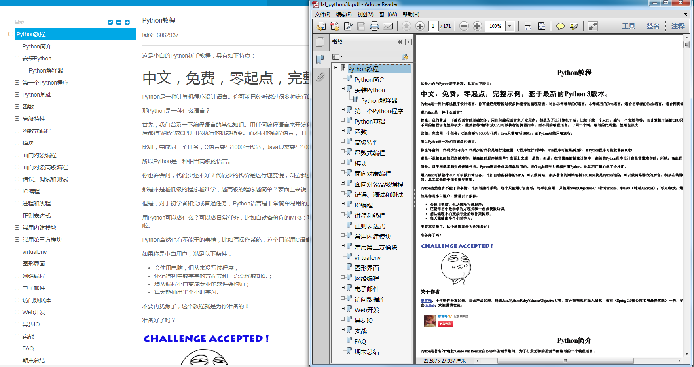

# crawler

#### 说明
将廖雪峰的py3k教程转换成pdf电子书

欢迎fork或者issues，通过探讨！！

#### 系统需求
python3.x

#### 使用步骤

```
pip install -r requirements.txt
```
> wkhtml2pdf说明

wkhtml2pdf 是一个用于将网页文档转换成pdf格式的工具，详细介绍见官网：http://wkhtmltopdf.org/downloads.html。
windows上直接去官网现在最新的稳定版本进行安装即可。网上有人说需要将wkhtml2pdf.exe放到$PATH中不然脚本会异常，而且在IDE中无法直接调试。
这也是确实存在的问题，不过通过查看pdfkit的文档可以很容易发现pdfkit提供了一个参数可以指定wkhtml2pdf的路径，以上提到的问题就不存在了。
centos和ubuntu上的安装如下：具体安装步骤参见官方文档
```
sudo yum install -y wkhtml2pdf # on centos
sudo apt-get install -y wkhtml2pdf # on ubuntu
```
#### 运行
```
python crawler_v2.py
```

#### 附加说明
其实在github上早有前人做过类似脚本，为什么还要发布这个脚本呢？个人认为他们做得不太精细，所以我自己就琢磨着写了这个脚本。
具体详见效果图：



#### 常见问题
由于廖老师的网站对爬虫的识别率实在是太高，用requests或者python3k自带的url库会被中途refuse。所以采用了chrome --headless进行爬取，
在控制台输出会有一些警告信息。
